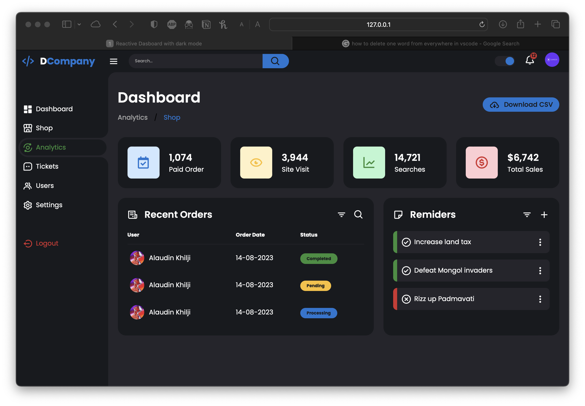
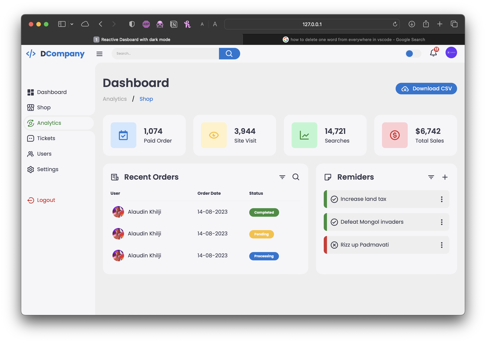

# Responsive Dashboard with Dark Mode

This is a responsive dashboard template with a dark mode option built using HTML, CSS, and JavaScript. It features a sidebar navigation menu, insights section, recent orders display, and task reminders.



## Features

- Responsive layout with a collapsible sidebar.
- Dark mode option for better user experience.
- Interactive navigation menu with active state highlighting.
- Insights section displaying key metrics.
- Display of recent orders with user details and status.
- Task reminders section with completed and pending tasks.

## Preview



## Getting Started

1. Clone this repository to your local machine:

   ```bash
   https://github.com/mxdara/Responsive-Dashboard-with-darkmode
   ```

2. Open the `index.html` file in your web browser to see the dashboard.

## Usage

- Click on the navigation menu items to navigate through different sections of the dashboard.
- Use the search bar in the navigation to search for content.
- Toggle the dark mode using the theme toggle switch.
- The insights section provides key metrics about the dashboard.
- The recent orders section displays recent orders with user details and status.
- The task reminders section lists tasks with completion status.


Created by [Sameer Ahad](https://github.com/mxdara)
